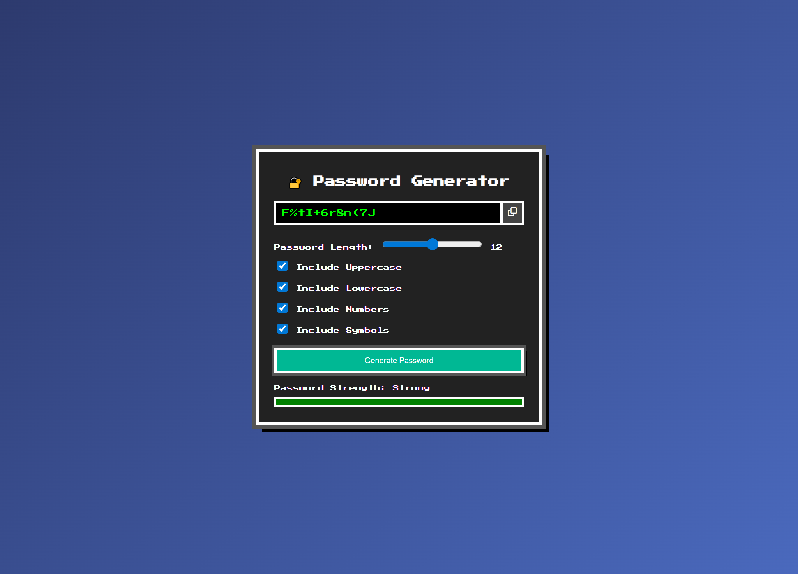

<h1 align="center">🔐 GERADOR DE SENHAS RETRÔ 🔐</h1>

###



<h4 align="center"><a href="https://joao-enrique.github.io/gerador-de-senhas/">Confira o projeto aqui</a></h4>

👾 Bem-vindo ao **Gerador de Senhas Retrô** — uma aplicação prática para criar senhas fortes e seguras, com um visual nostálgico em **pixel art**. 🚀  

###

<h2 align="left">🕹️ Funcionalidades</h2>

###
- ✅ Geração de senhas aleatórias  
- ✅ Escolha do tamanho da senha  
- ✅ Opção de incluir letras maiúsculas, minúsculas, números e símbolos  
- ✅ Botão para copiar a senha com 1 clique  
- ✅ Visual retrô em pixel art  
- ✅ Design responsivo  

###

<h2 align="left">🧠 Como funciona?</h2>

###
1. Selecione as opções desejadas (caracteres, números, símbolos etc.).  
2. Defina o tamanho da senha.  
3. Clique em **Gerar** para criar sua senha segura.  
4. Clique no botão de **copiar** para salvar a senha na área de transferência.  

Simples, rápido e nostálgico 🎨  

###

<h1 align="left">💾 Tecnologias utilizadas</h1>

###
<div align="left">
  
  
  
  
  
</div>

###

<h1 align="left">🧪 Como rodar?</h1>

###
<p align="left">1. Faça o clone do projeto:</p>

```bash

https://github.com/joao-enrique/gerador-de-senhas.git

```

<p align="left">2. Abra o <code>index.html</code> em seu navegador.</p>
<h1 align="left">👨‍💻 Estrutura</h1>

📁 password-generator-retro<br>
├── index.html # Estrutura principal<br>
├── style.css # Visual retrô/pixel art<br>
├── script.js # Lógica de geração de senhas<br>
└── README.md # Você está aqui!

<h1 align="left">🔮 Futuras melhorias</h1>

Opção de salvar várias senhas geradas 📂

Dark mode retrô 🌙

Exportar senhas em arquivo .txt 📄

Animações 8-bit na geração 🎮

<h1 align="left">📬 Contato</h1> <p align="left">Feito com ❤️ por João Enrique.</p> <div align="left"> <a href="https://www.instagram.com/joao__dev/" target="_blank">  </a> <a href="https://www.linkedin.com/in/joao-enrique-dev/" target="_blank">  </a> <a href="https://www.youtube.com/@joao__dev" target="_blank">  </a> </div>

> “Segurança nunca foi tão divertida — senhas fortes com estilo retrô.” – Pixel Security